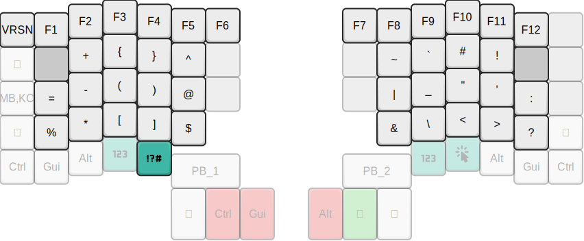
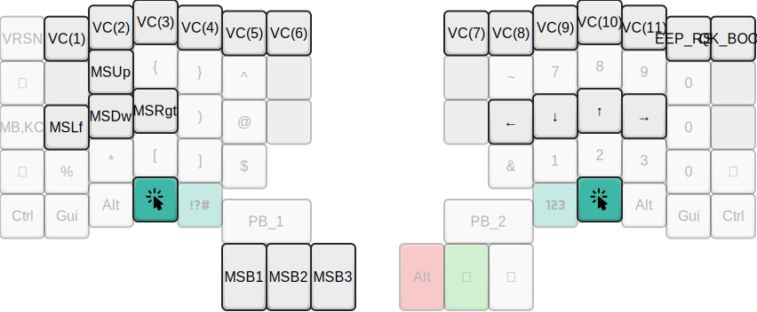

# Personal Moonlander keymap
My work-in-progress Moonlander keymap

## Goals
- Vim-friendly features
- Layers are thumb-accessible
- Avoid moving fingers more than one row away from home row for keys
- Symbol layer for programming
- Avoid chords and combos on the base and symbol layers
- Don't put common actions on the big red thumb keys
- No RGB or audio (although I might use RGB for additional indicators)

## Tour
I currently have four layers. A base layer, symbol layer, numpad layer, and a
GUI layer.

### Base layer

The base layer is a standard QWERTY layout. I've tried to keep most of the keys
where you'd expect for now.

#### Escape
On my previous 60% keyboard, I have grown used to remapping Caps Lock to Escape
(left pinky). This muscle memory has been hard to break, so I've opted to keep
it in the same position.

#### Space
After trying to use the default mapping with space on the left, I finally gave
up and moved it to the right thumb key.

I tried adding mod-tap on space but found I was accidentally triggering it too
often.

#### Backspace
I'm used to using Ctrl-H/Ctrl-W in insert mode in Vim for backspace, but I like
the idea of having it be accessible in other applications without leaving the
home row. I moved backspace to where space was on the left thumb key, which
mirrors the Kinesis Advantage2 layout.

Having space and backspace on different sides feels more faster when correcting
errors.

#### Return/Shift
I kept return on the right thumb key, but it is demoted to the second key. I
don't use it as often as space or backspace and found I'd accidentally hit it
too often in its default position. The idea of accidentally hitting enter when
typing potentially dangerous shell or SQL commands doesn't appeal to me much.

I'm trying out using a mod-tap key on the enter, which allows it to act as
shift when held. I typically avoid the right shift key, but I've been trying to
retrain myself (it feels more natural on a split keyboard).

While I've kept the shifts where they usually would be (under the pinkies), I
like having this as a thumb key for all-caps words or title case. This is
useful for typing uppercase and camel case identifiers.

I don't normally like mod-tap keys as it introduces a delay in feedback, but I
feel like I usually hit return rapidly enough for this to be unnoticeable. I am
also less likely to trigger it accidentally in this position.

#### Layer keys
I moved the layer keys to be under the thumbs. I didn't like having to use my
pinkies to access the symbol layer as it meant breaking my flow.

I don't know how I feel about having the GUI layer activated like this just
yet, but it's nice to be able to quickly access the mouse or arrow keys without
lifting my hands off the keyboard.

#### Other modifiers
The other modifiers are where they'd usually be, as well as adding them as
one-shot keys on the thumbs. I might keep them only on the thumb keys if I like
this setup enough.

### Symbol layer

The symbol layer is designed with the idea of having the commonly used symbols
for programming be readily accessible. I laid this out using a tool to count
the most frequently occurring symbols in my shell history and some large open
source codebases in languages I use. I then tweaked it manually until I was
happy with the layout.

I kept the most accessible QWERTY symbols in their usual spots, and their
shifted forms appear above them in the symbol layer. This means I never have to
hit shift to type a symbol.

#### Brackets
I like having the pairs of brackets be adjacent. The round brackets are on the
home row as they are the most commonly used. The curly and square brackets, are
on the same fingers directly above and below that respectively.

#### Underscore and Dash
Underscore and dash are on the home row for more quickly typing kebab- and
snake-cased identifiers. While kebab-case isn't nearly as common as underscore
(which was the second-most common symbol in the codebases I looked at), dashes
frequently are used for flags in shell commands, so I promoted it to a home row
symbol.

### Number layer

I don't like extending my fingers to the number row all that much, and I'm
trying to break that habit. I am considering removing numbers from the base
layer altogether.

I haven't decided whether I want the numpad-style layout that is the default or
try something else, but the idea of having zero on the bottom row of the
keyboard isn't all that appealing as I'm trying to keep most of the keys I hit
only one key away from the home row.

### GUI Layer

I might change the name for this layer, but it's for making GUI apps more
accessible.

#### Arrow keys
I've mapped the arrow keys to where HJKL are on the base layer. This feels more
natural for navigating other applications that need them without moving from
the home row.

#### Mouse
I've moved the mouse to WASD instead of EDSF (WASD, but one column over) as it
seemed more logical. Clicking is done on the thumb cluster.
