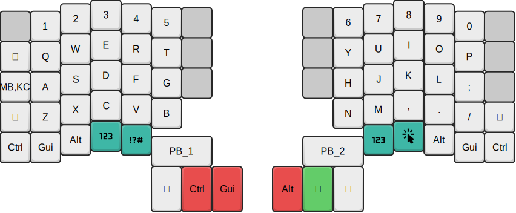
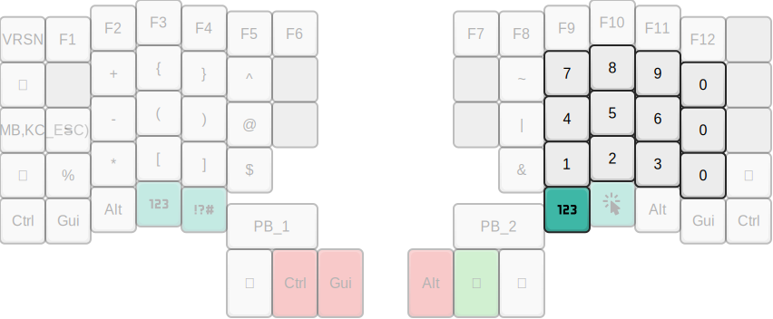

# Personal Moonlander keymap
My work-in-progress Moonlander keymap

## Goals
- Vim-friendly features
- Layers are thumb-accessible
- Avoid moving fingers more than one row away from home row for keys
- Symbol layer for programming
- Avoid chords and combos on the base and symbol layers
- Don't put common actions on the big red thumb keys
- No RGB or audio (although I might use RGB for additional indicators)

## Tour
I currently have four layers. A base layer, symbol layer, numpad layer, and a
GUI layer.

### Base layer

The base layer is a standard QWERTY layout. I've tried to keep most of the keys
where you'd expect for now.

Space and Return remain in their default positions, under the left and right
thumbs respectively.

#### Escape
On my previous 60% keyboard, I have grown used to remapping Caps Lock to Escape
(left pinky). This muscle memory has been hard to break, so I've opted to keep
it in the same position.

#### Backspace
I'm used to using Ctrl-H/Ctrl-W in insert mode in Vim for backspace, but I like
the idea of having it be accessible in other applications without leaving the
home row.

#### Tab
I avoid using Tab for autocompletion in Vim, but it is sometimes useful for
completion in shells.

#### Shift
I typically avoid the right shift key, but I've been trying to retrain myself
(it feels more natural on a split keyboard).

While I've kept the shifts where they usually would be (under the pinkies), I
like having this as a thumb key for all-caps words or title case. This is
useful for typing uppercase and camel case identifiers.

The thumb shift is currently on the right third key, but I might move it as a
mod-tap key on Space or Return. I don't normally like mod-tap keys, as it
introduces a delay in feedback, but I feel like I usually hit these keys
rapidly enough for this to be unnoticeable.

#### Layer keys
I moved the layer keys to be under the thumbs. I didn't like having to use my
pinkies to access the symbol layer as it meant breaking my flow.

I don't know how I feel about having the GUI layer activated like this just
yet, but it's nice to be able to quickly access the mouse or arrow keys without
lifting my hands off the keyboard.

#### Other modifiers
The other modifiers are where they'd usually be. I can see the value of having
these on the thumbs, but I can't see how I'd be able to hit multiple modifiers
like this (especially something on the symbol layer)

I want to experiment with one-shot modifiers (sticky keys) for thumb modifiers
in future.

### Symbol layer

The symbol layer is designed with the idea of having the commonly used symbols
for programming be readily accessible.

I haven't yet decided where everything should fit on this layer yet and am
actively tweaking it.

#### Brackets
I like having the pairs of brackets be adjacent and not require holding shift.

The round brackets are on the home row as they are the most commonly used. The
curly and square brackets, are on the same fingers directly above and below
that respectively.

#### Minus
I'm experimenting with having Space become Minus (dash) on the symbol layer.
While this might seem odd, this key also doubles as underscore when holding
shift.

I think it might help for typing kebab- and snake-cased identifiers more
quickly.

### Numbers

I don't like extending my fingers to the number row all that much, and I'm
trying to break that habit. I am considering removing numbers from the base
layer altogether.

I haven't decided whether I want the numpad-style layout that is the default or
try something else, but the idea of having zero on the bottom row of the
keyboard isn't all that appealing as that clashes with Alt on the right hand.

### GUI Layer

I might change the name for this layer, but it's for making GUI apps more
accessible.

#### Arrow keys
I've mapped the arrow keys to where HJKL are on the base layer. This feels more
natural for navigating other applications that need them without moving from
the home row.

#### Mouse
I've moved the mouse to WASD instead of EDSF (WASD, but one column over) as it
seemed more logical. Clicking is done on the thumb cluster.
